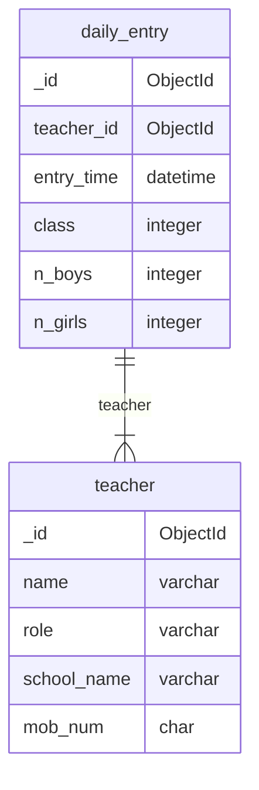
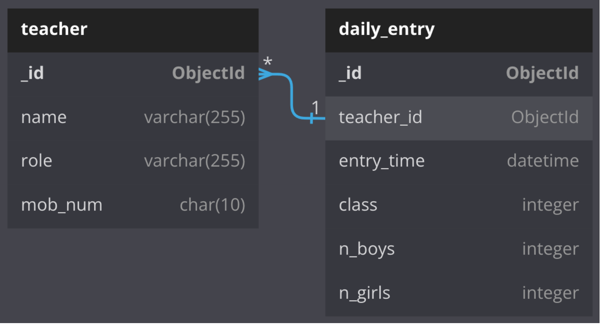

# Attendance System

## ER Diagram: attendance_db



<!-- ```sql
-- dbdiagram.io
-- Database: attendance_db

Table teacher {
  _id ObjectId [primary key]
  name varchar(255)
  role varchar(255)
  school_name varchar(255)
  mob_num char(10)
}

Table daily_entry {
  _id ObjectId [primary key]
  teacher_id ObjectId
  entry_time datetime
  class integer
  n_boys integer
  n_girls integer
}

Ref: teacher._id > daily_entry.teacher_id
``` -->



## Authentication of teacher

### Registration Field

```json
{
  "name": "string",
  "role": "choice",
  "school_name": "string",
  "mob_num": "string[10]"
}
```

### Login Field

- Validate the teacher and save his records in `.cache` file at local.

```json
{
  "name": "string",
  "mob_num": "string[10]"
}
```

## Daily Entry by teacher

- Take the `teacher_id` from the logged in user details.
- Take `mob_num` as integer input and store it as a string data type.

### Form Fields

```json
{
  "class": "integer",
  "n_boys": "integer",
  "n_girls": "integer"
}
```

## Updating of data

### Teacher's data

Update using `_id` which is stored in local file `.cache`. Form shows all the data of the teacher by default while updating the data then the user change the required data and submit data which update the data at MongoDB database.

### Daily Entry

Mistakenly, user submitted the wrong entry then he/she can update the submitted data **only of current date**.
